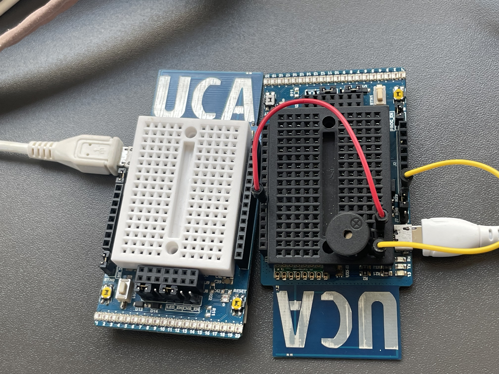
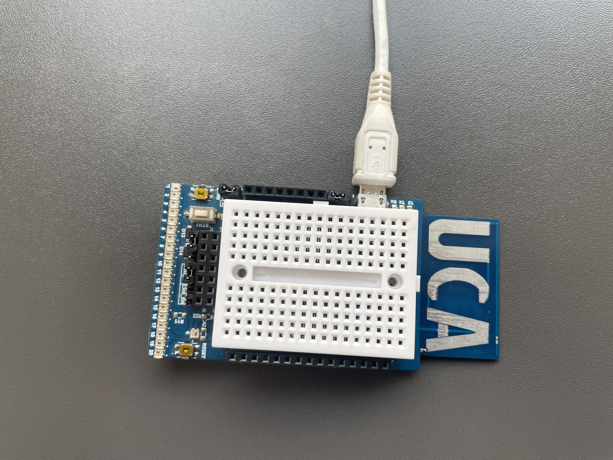
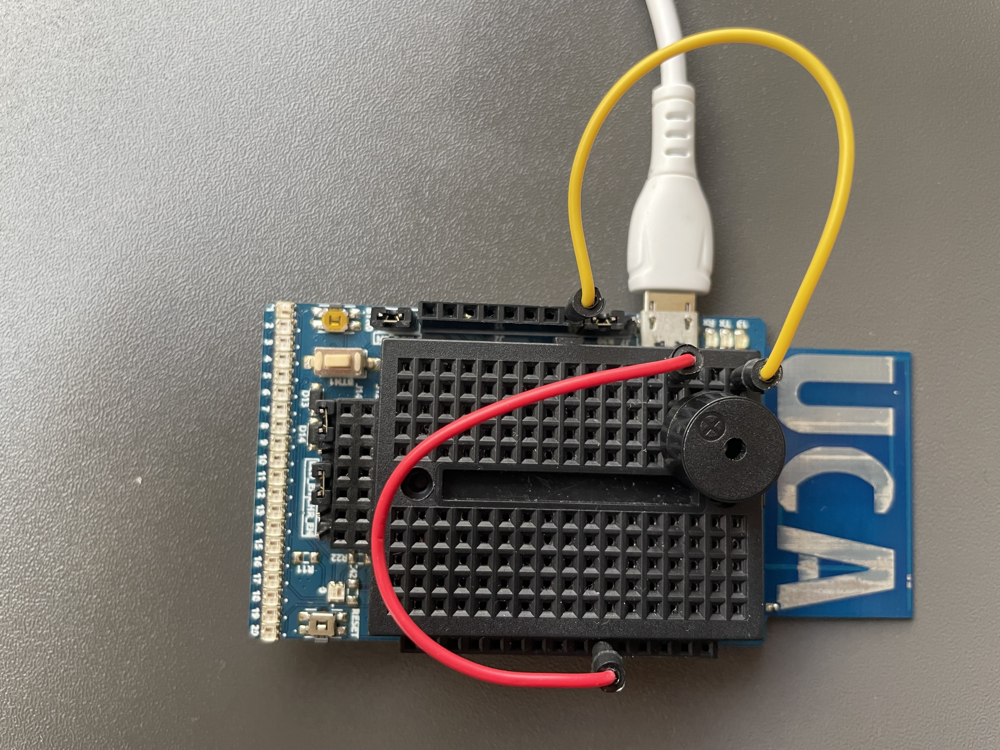
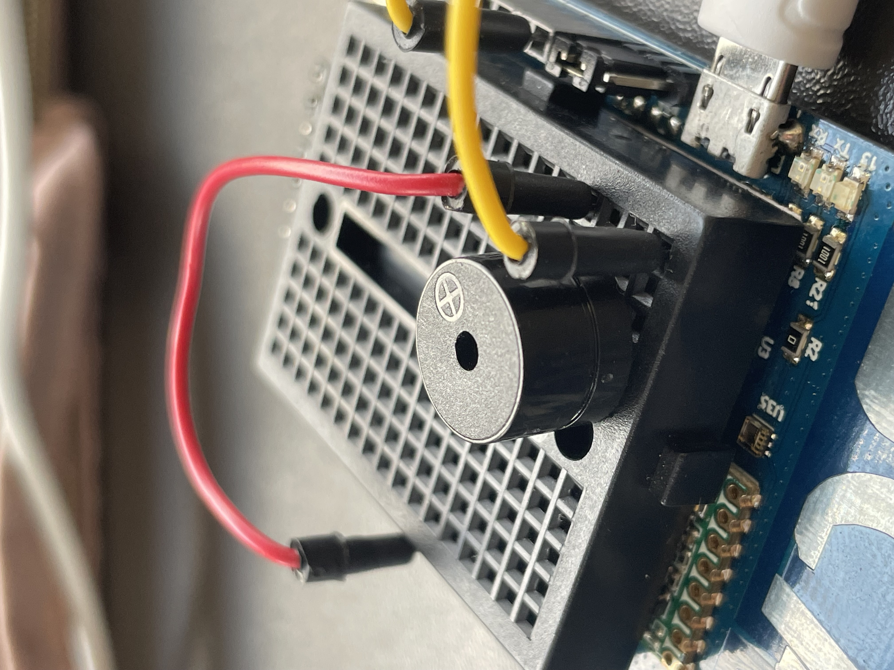
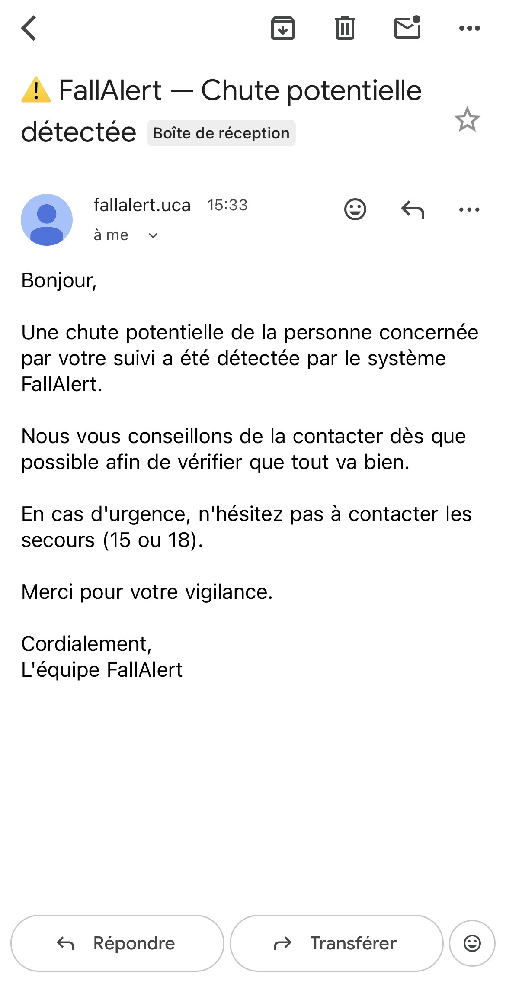
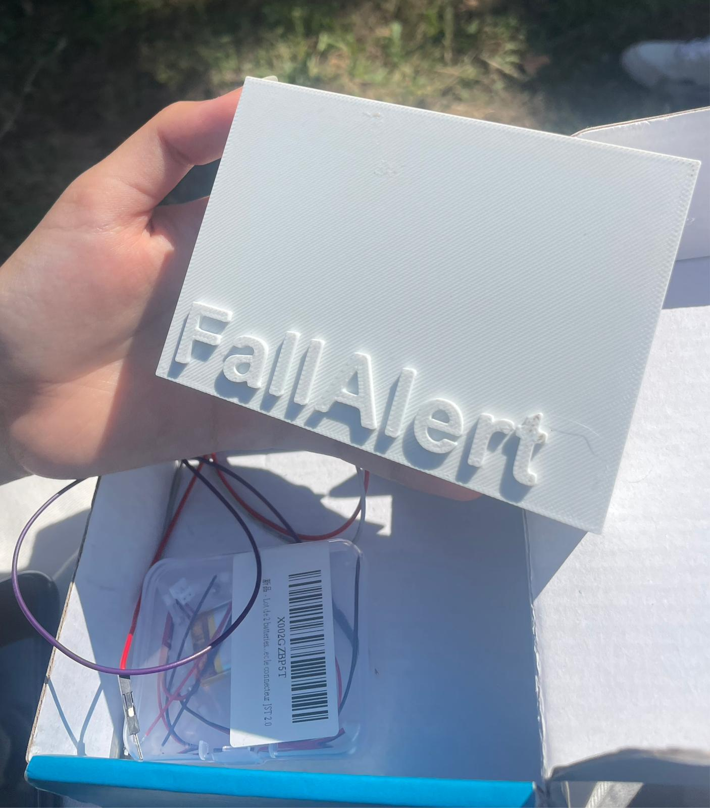

# FallAlert — Système de détection de chutes:

FallAlert est un système embarqué de détection de chutes en temps réel,
conçu pour protéger les personnes âgées ou vulnérables en alertant
automatiquement leurs proches par email.

## Présentation du projet:

Ce projet a pour objectif de détecter automatiquement une chute grâce
à un accéléromètre, et d'envoyer une alerte email immédiate aux proches
via un système de communication sans fil LoRa.

## Equipe:

- Chahd Habjiya
- Lynda Adjaoud

## Technologies utilisées:

- "Arduino" :Programmation des microcontrôleurs
- "LoRa" :Communication sans fil entre émetteur et récepteur
- "Accéléromètre (MPU6050)" :Détection du mouvement et des chutes
- "Buzzer" :Alerte sonore locale
- "Python" :Envoi automatique d'email lors d'une chute
- "Batterie" :Alimentation autonome du dispositif

## Fonctionnement:

1. L'accéléromètre détecte une chute
2. L'émetteur Arduino envoie le message 'CHUTE' via LoRa
3. Le récepteur Arduino reçoit le message et déclenche le buzzer
4. Le script Python intercepte l'alerte et envoie un email aux proches

## Fichiers

- 'projet.ino' : Code Arduino de l'émetteur
- 'projet_recp.ino' : Code Arduino du récepteur
- 'pitches.h' : Notes musicales pour le buzzer
- 'mail envoye lors d'une chute.py' : Script Python d'envoi d'email

## Photos du projet:

### Cartes

### Emetteur

### Recepteur

### Buzzer

### Email reçu lors d'une chute

## Design 3D de la boite

- [Boite](assets/Boite_FallAlert.stl)
- [Couvercle](assets/couvercle_FallAlert.stl)

### Boite imprimée
- 

## l'email reçu:

Bonjour,

Une chute potentielle de la personne concernée par votre suivi a été
détectée par le système FallAlert. Nous vous conseillons de la contacter
dès que possible afin de vérifier que tout va bien.

En cas d'urgence, n'hésitez pas à contacter les secours (15 ou 18).

Merci pour votre vigilance.

Cordialement,
L'équipe FallAlert

## Slides de présentation

[Voir les slides](https://github.com/Chahdhbj/L1_FallAlert_2026/raw/main/presentation_fallalert.pdf)

---

Projet réalisé dans le cadre du module Communication sans fil — Licence 1, 2026
Encadré par Fabien Ferrero, Julian Roqui et Leo Peyruchat
